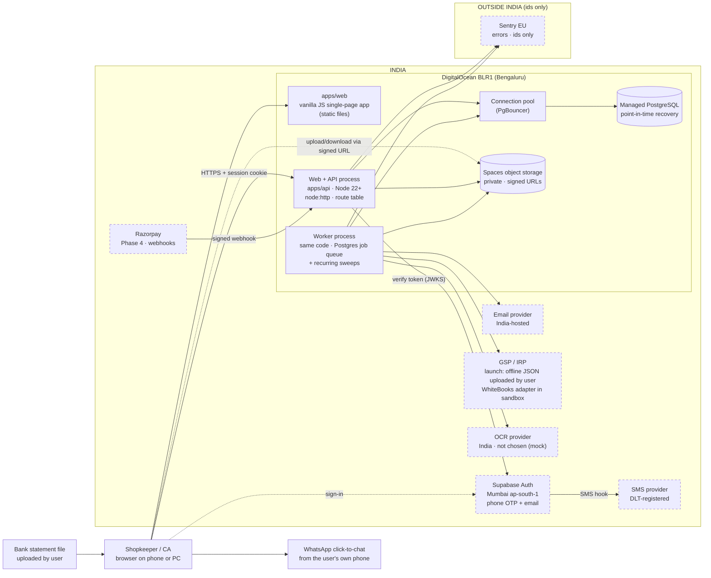

# Architecture

How Karobar is built and run as a service. Written for issue #339. It follows on from
[`system-design.md`](system-design.md) (#338), which covers who uses Karobar, what it must do and
how big it gets. Each decision D1–D13 has its own record in [`docs/decisions/`](decisions/).

---

## What we decided, in simple words

- **Your books stay in India.** The database, the files, the backups and the login records are kept
  in data centres in Bengaluru and Mumbai.
- **You log in with your phone number.** We send a one-time code by SMS. Email works too.
- **One main program runs the app.** A second copy of the same program does slow work in the
  background — sending reminders, making PDFs, retrying government uploads — so the counter never
  waits.
- **There is one database.** It holds the books, the list of background jobs and the login limits.
- **Bills are shared on WhatsApp from your own phone**, as today. Our servers do not send your
  customers' numbers abroad.
- **Crash reports go to a service in Europe** with reference numbers only — never names, phone
  numbers or bills.
- **Nothing you see in the shop changes.** Billing, stock and GST work exactly as before.

**Scope of this document.** These decisions change how Karobar is built underneath, not what it does
for the shopkeeper. The eight rules, the supported scope and the out-of-scope list in
[`docs/product/00-principles-and-scope.md`](product/00-principles-and-scope.md) are unchanged.
**Who chose:** the owner did not evaluate the technical choices. The agent chose each on the
recommendation in #339; any of them is revisited when a reason appears (§9).

---

## 1. Components (target)



A dashed border marks an outside vendor. Everything in the **INDIA** box keeps its data in India.
Sentry is the only service outside India, and it receives ids only (D13).

## 2. What each box is, and why it is there

| Box | What it is / why it is there |
| --- | --- |
| **Browser (apps/web)** | The screens. Plain JavaScript with nothing to compile, so it loads fast on a cheap phone. |
| **Web + API process** | The main program. Serves the screens, checks who you are and what you may do, saves bills. Two copies run so one can restart without downtime. |
| **Worker process** | The same program started in "worker" mode. Does slow or retryable work — PDFs, emails, reminders, government uploads — so the counter never waits. |
| **Connection pool (PgBouncer)** | A doorman for the database: many requests share a few connections. Without it, connections run out first (system design §7.6). |
| **Managed PostgreSQL** | The one database: books, users, sessions, the job list, rate-limit counters. DigitalOcean runs it and keeps backups that can be rewound to any minute in the last 7 days. |
| **Spaces** | File storage for supplier bills, statements and logos. The browser uploads and downloads through short-lived signed links after a permission check. |
| **Supabase Auth (Mumbai)** | The login service. Sends and checks the OTP and gives the browser a signed token, which our server checks once and swaps for its own session. We store no passwords. |
| **SMS provider (DLT)** | Delivers the OTP text. Indian rules require the sender and template to be DLT-registered (an owner action). |
| **Email provider (India)** | Sends bills and reminders by email. In India because emails carry business data. |
| **GSP / IRP** | The government's e-invoice, e-way and return systems. At launch the user downloads our JSON and uploads it on the portal. The WhiteBooks adapter is sandbox-only until #50 picks a GSP. |
| **Banks** | No live connection. The user uploads a statement (PDF, Excel or CSV); we read it and match it to the books. |
| **WhatsApp** | A click-to-chat link that opens WhatsApp on the user's own phone with the bill's message and link. Our servers send nothing to WhatsApp. |
| **OCR provider** | Reads photos of supplier bills. Must run in India; none chosen yet, a mock stands in. |
| **Sentry (EU)** | Collects crash reports. Receives ids and error codes only. |
| **Razorpay** | Takes subscription payments (Phase 4). Tells us about payments through signed webhooks. |

---

## 3. Stack per layer

| Layer | Choice | Rejected alternative | Why rejected |
| --- | --- | --- | --- |
| Runtime | Node 22+ running `.ts` directly (`--experimental-strip-types`), no build | A bundler or framework (Vite, Next.js) | A build step, a config and a second place for bugs. What runs is exactly what is in the repo. |
| Web | Vanilla JS SPA (`apps/web`) | React | A build chain and a heavy bundle for an ₹8,000 phone; the app already works without one. |
| API | `node:http` + a route table (#344) | Express / Fastify | Routing is all they would add; a route table does it with no dependency. |
| Database | PostgreSQL | Managed NoSQL | Double-entry books need transactions, constraints and row-level security. |
| Jobs | Our queue in Postgres (D5) | Redis + BullMQ | A second datastore, and it cannot share a transaction with the bill. |
| Validation | Zod at the boundary (D4) | Our own validator | More code to own; Zod is small and well known. |
| Rate limits | Postgres counters (D6) | Redis | One store is enough at ~100 req/s. |
| Login | Supabase Auth, Mumbai (D1) | Clerk | US-only hosting breaks D13. |
| Hosting | DigitalOcean BLR1 (D3) | AWS Mumbai | More IAM, networking and bill-watching for a small team. |
| Errors | Sentry EU, ids only (D7) | Self-hosted GlitchTip | One more server to run. |
| Payments | Razorpay (D9) | Cashfree | Both work; Razorpay's subscription webhooks are better documented. |

---

## 4. Folder structure (as it is)

```
apps/
  api/        HTTP server (server.ts), runtime wiring (runtime.ts), demo-application.ts
  web/        vanilla JS SPA (app.js) and a small static server that also serves /api
packages/     ~37 domain packages, each with src/ and test/
ops/          run-the-service code and operator CLIs
tools/        developer scripts
docs/         product rules, contracts, system design, this file, decisions/
```

| Group | Packages | One line |
| --- | --- | --- |
| Foundation | `kernel` | Money, quantities, ids and errors; no dependencies. |
| | `platform` | Auth, access, connectors, database (`tenantTransaction`), migration registry, notifications, bank statement import. |
| Books | `ledger`, `masters`, `inventory`, `rules-engine`, `compliance-register` | Double-entry ledger, parties and items, stock, deterministic rules, rule sources. |
| Selling and buying | `sales`, `receivables`, `purchasing`, `returns`, `trade-terms`, `collections` | Bills, money owed, supplier bills, notes, terms, reminders. |
| GST | `gst-calc`, `gst` (e-invoice), `transport` (e-way, vehicle), `gst-returns`, `itc`, `gsp`, `compliance-calendar` | Tax maths, government documents, returns, input credit, the GSP adapter, due dates. |
| Output | `invoice-templates` (puppeteer PDF), `reports` | Bill and note PDFs, reports. |
| Bank | `bank-feeds`, `bank-reconciliation` | Statement lines and matching. Only a test imports `bank-reconciliation`. |
| Setup | `onboarding`, `migration`, `subscriptions` | First run, import from Tally/BUSY/Vyapar spreadsheets, plans. |
| Helpers | `assistant`, `action-agent`, `voice-assistant`, `ux-vocabulary` | Guided help, confirmed actions, voice input, plain-word labels. |
| Quality | `golden-dataset`, `release-gates` | Known-correct examples; checks run by `npm run gates`. |
| Not imported yet | `delivery`, `rate-advisor` | Nothing imports them. |

**ops/**: `operations` (job queue and recurring runner), `security` (AES-256-GCM field encryption,
log redaction, privacy export/delete, recovery), and the CLIs `gsp-selection`, `gsp-production`,
`bank-feed-selection`, `vehicle-data-access`, `vendor-onboarding`.
**tools/**: `gsp`, `migrations` (new migration id), `spec-docs`, `trade-marks`, `test`.

**Imports.** Most packages import each other through the `@invoice/<name>` alias; `platform`,
`ops/*`, `gsp` and `masters` still use relative `../../../packages/...` paths in places.

---

## 5. How it runs today, and the target

| Area | Today | Target | Issue |
| --- | --- | --- | --- |
| Data | All in memory in one process; `apps/api/src/demo-application.ts` builds `InMemory*` stores per company; a restart loses everything | Every store in Postgres through `tenantTransaction`, row-level security on `company_id`, one transaction per business action | #340, #363–#368 |
| Postgres adapters | Only `ledger` and `returns`, neither wired | Every module | #366 |
| Users and login | Hard-coded in `runtime.ts`, unsalted SHA-256 | Supabase Auth; our own session in Postgres | #342 (D1) |
| Session | Bearer token in `localStorage` | `HttpOnly` cookie + Origin check | #342 (D2) |
| Roles | None; 118 flat permissions | Owner, Admin, Accountant, Staff, Viewer; a table, tests generated from it | #343 |
| Routing | ~150 routes in one `if` chain in `server.ts` | Route table: schema, permission, paging, plain 500 | #344 (D4) |
| Files | Not stored | Spaces, signed links, scoped by company | #341 |
| Background work | 60 s `setInterval` in the API, only under `npm run dev`; per-company polling | Worker process, Postgres queue, one sweep per job kind | #345 (D5) |
| Rate limits | None | Postgres counters, spending caps | #350 (D6) |
| DB connections | Pool hard-coded to 5 | Pool sized from configuration, behind PgBouncer | #340, #361 |
| Errors and logs | `console` only | JSON logs with request ids; Sentry EU, ids only | #357, #358 (D7) |
| Hosting | A laptop | DigitalOcean BLR1, staging and production | #356 (D3) |
| Payments | Mock | Razorpay, verified webhooks | #346 (D9) |

---

## 6. Background jobs

**Where.** In the worker process: the same code and image as the API, started in worker mode. The
API never does slow work inside a request.

**How a job is added.** The business action (e.g. finalise a bill) writes its rows **and** the job
row in the **same transaction** (outbox). If the bill is saved, the job exists; if it rolls back,
so does the job. The unit-of-work record that defines this belongs to #363.

**How a job is taken.**

```sql
SELECT … FROM jobs
 WHERE state = 'ready' AND run_at <= now()
 ORDER BY run_at
 FOR UPDATE SKIP LOCKED
 LIMIT 10;
```

Two workers never take the same job and never wait on each other.

**Rules each job follows**, as `OperationalQueue` does today: idempotency key `company:kind:key`
(adding the same job twice returns the first); exponential backoff with jitter; max attempts, then
dead-letter shown on the **Operations** screen, replayable if the job is idempotent. External calls
and PDF rendering happen **outside** any database transaction.

**Recurring jobs.** Today `RecurringWorkRunner` schedules each job **per company** and polls every
company whether or not it has work — ~1.56 million runs a day at 1,000 companies, 55× the useful
work (system design §7.5). Target: **one sweep per job kind** ("notifications due now, any
company"), enqueueing one job per due item. Work then follows the number of bills, not companies.

---

## 7. Third-party services and monthly cost (year one)

At 1,000 companies, ~100 req/s festival peak, ~110 GB database and ~275 GB files by year end.
**All figures are estimates** at ₹85 = US$1, before GST; check vendor price pages before signing up.

| Service | What we buy | US$/month | ₹/month |
| --- | --- | --- | --- |
| DigitalOcean App Platform | 2 web instances, 1 worker (2 GB, for Chromium PDFs) | 75–150 | 6,400–12,800 |
| DigitalOcean Managed PostgreSQL | Primary + standby, 4–8 GB RAM, PITR, storage to ~250 GB | 150–300 | 12,800–25,500 |
| DigitalOcean Spaces | 250 GB included, then ~$0.02/GB | 5–15 | 425–1,300 |
| Supabase Pro | One Mumbai project | 25–40 | 2,100–3,400 |
| SMS OTP (DLT) | 20k–50k OTPs at ~₹0.15–0.25, plus one-time DLT registration | 35–150 | 3,000–12,500 |
| Email (India) | 50k–400k mails | 10–40 | 850–3,400 |
| Sentry Team | EU region | 26–40 | 2,200–3,400 |
| Razorpay | ~2% per payment + GST on the fee; no monthly fee | variable | variable |
| Domain and TLS | Domain ~₹1,000/year; TLS free | ~1 | ~100 |
| **Total (excluding Razorpay)** | | **≈ 330–735** | **≈ 28,000–62,500** |

The pen test (D11, ≈ ₹1.5–4 lakh) is a one-time cost and not included.

---

## 8. Dependencies in `package.json`

| Package | Type | Why it is there |
| --- | --- | --- |
| `pg` | dependency | Postgres driver (`packages/platform/src/database.ts`). |
| `pdfjs-dist` | dependency | Reads PDF bank statements (`packages/platform/src/banking.ts`). |
| `read-excel-file` | dependency | Reads XLSX bank statements and Tally/BUSY/Vyapar exports (`packages/migration`). |
| `puppeteer` | dependency | Headless Chromium rendering bill, note and e-way PDFs (`packages/invoice-templates/src/pdf.ts`); also a browser test. |
| `fflate` | dependency | **Only a test uses it** (`packages/platform/test/banking.test.ts`). Should move to `devDependencies` — flagged, not changed here. |
| `@tabler/icons` | dev | Source for the icon library built by `npm run marks:build`. |
| `typescript` | dev | Type checking only (`tsc --noEmit`); Node runs `.ts` directly. |
| `@types/node`, `@types/pg` | dev | Types for type checking. |

**Planned additions:** `zod` (D4), `@sentry/node` (D7). For Supabase login, **no new dependency**
is preferred: the server verifies Supabase tokens with `node:crypto` against the project's published
keys (D1).

---

## 9. The three riskiest decisions

| Decision | Why it is risky | What would make us revisit it |
| --- | --- | --- |
| **D12 offline billing** (a number series per device, a stock allowance per device) | Allowances may be too small for a busy counter; sync disagreements (a changed rate or price) need a person to resolve. Rule 3 must hold even offline — the allowance design guarantees it, but only if every reservation path respects device holds. | Pilot counters run out of allowance or hit many sync exceptions. Fallback: online only for stock-tracked items — never negative stock. |
| **D1 Supabase Auth** | Identities live with a vendor; its backups or logs may sit outside India even with a Mumbai project. | Supabase cannot confirm in writing that backups and logs stay in India, prices change sharply, or an outage blocks sign-ins. Exit: self-host its open-source auth server in BLR1 (same API), or move to own accounts using the same SMS provider. |
| **D5/D6 everything on one Postgres** | Connections run out before CPU, memory or disk (system design §7.6); job claims and rate-limit writes compete with billing. | Load test (#361) shows the pool saturating at festival peak, or queue and rate-limit queries take more than ~20% of database time. Fix in order: pooling and pool size, a read replica for reports, then move rate limits or the queue out. |

---

## 10. Decision records

| # | Decision | Record |
| --- | --- | --- |
| D1 | Login: Supabase Auth, Mumbai, phone OTP + email | [0001](decisions/0001-login-identity.md) |
| D2 | Session in an `HttpOnly` cookie | [0002](decisions/0002-session-cookie.md) |
| D3 | Hosting: DigitalOcean BLR1 | [0003](decisions/0003-hosting-india-region.md) |
| D4 | Input validation: Zod at the boundary | [0004](decisions/0004-input-validation-zod.md) |
| D5 | Background jobs: our queue in Postgres | [0005](decisions/0005-background-jobs-postgres-queue.md) |
| D6 | Rate limits: Postgres | [0006](decisions/0006-rate-limit-store-postgres.md) |
| D7 | Errors and logs: Sentry EU, ids only | [0007](decisions/0007-errors-and-logs.md) |
| D8 | Year-one scale and uptime | [0008](decisions/0008-year-one-scale-and-uptime.md) |
| D9 | Payments: Razorpay | [0009](decisions/0009-payments-razorpay.md) |
| D10 | Retention | [0010](decisions/0010-retention.md) |
| D11 | Pen test before the first paying customer | [0011](decisions/0011-pen-test.md) |
| D12 | Offline billing and sync | [0012](decisions/0012-offline-billing-and-sync.md) |
| D13 | Data residency | [0013](decisions/0013-data-residency.md) |

The unit-of-work and outbox record (one transaction per business action) lands with #363.
